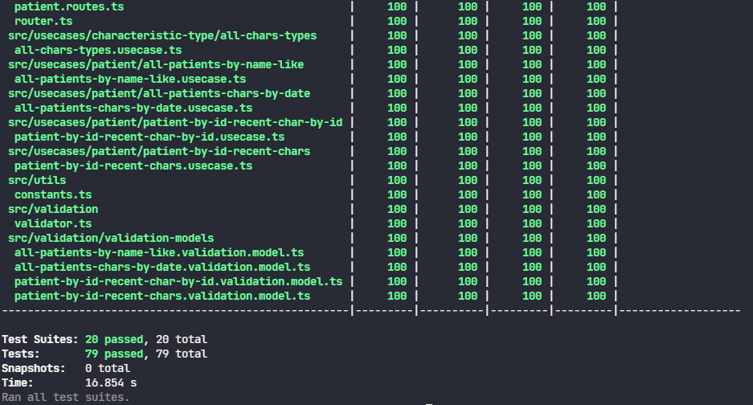

# ANLIX-CHALLENGE

> ## API REST: Tecnologias e Ferramentas

* Node.js
* Typescript
* Postgres
* Express
* TypeORM
* Jest
* Husky
* Lint Staged
* ESLint
* Swagger

> ## Frontend: Tecnologias e Ferramentas

* Dart
* Flutter
* GetX
* Dio

> ## Requisitos

1. Docker
2. Docker Compose
3. Node.js
4. NPM

> ## Setup

1. `docker compose up -d` para subir ambas as aplicações.
2. `docker compose -f docker-compose.api.yml up -d` para subir apenas a api e o banco de dados.

## Frontend

1. Para acessar a aplicação frontend certifique-se de estar rodando a aplicação e acesse [localhost:8080](http://localhost:8080)
2. Dentro da pasta vídeos há um pequeno vídeo mostrando o uso da aplicação.

## Documentação da API

Para ver a documentação da api certifique-se que está rodando a aplicação e acesse [localhost:3000/docs](http://localhost:3000/docs)

## Testes

Para rodar os testes da api certifique-se de navegar para pasta api do projeto e instalar todas as dependências com o comando `npm install`.

Para rodar somente os testes **unitários** rode o comando `npm run test:unit`

Para rodar somente os testes de **integração** rode o comando `npm run test:integration`

Para rodar todos os testes e obter o relatório de cobertura rode o comando `npm run test:coverage`

# Modelagem do banco de dados

